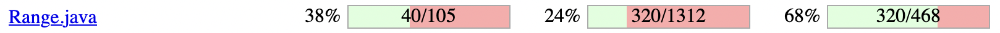
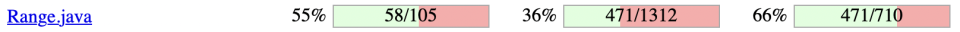

**SENG 438 - Software Testing, Reliability, and Quality**

**Lab. Report \#4 – Mutation Testing and Web app testing**

| Group \#:      |     |
| -------------- | --- |
| Student Names: |     |
| Brian Nguyen              |     |
| Ideen Banijamali               |     |
| Dimitar Janevski
| Javier Capobianco    |

# Introduction
In this lab, we will be exploring Mutation Testing and GUI Testing. During the first part, we will learn how to use a mutation testing tool to introduce mutation faults in a Java code-base. We will also learn how to interpret the mutation scores and utilize this knowledge to design new test cases that enhance the overall quality of our test suite.

In the second section, we will focus on GUI test automation using the most common technique of record and replay. We will be working with a well-known tool for web interface testing called Selenium, and we will also compare it to another alternative, Sikulix.

# Analysis of 10 Mutants of the Range class 
1. 95: Incremented (a++) double local variable number 3 → SURVIVED
This mutation causes the value of this.lower to be incremented after it is used. Our test suite tested the function but did not do a good job identifying this particular mutation of the code, therefore the mutation survived. This case is difficult to identify because we must reuse the variable in another method to detect this problem.

2. 157: greater than to greater or equal → SURVIVED
This mutation causes the comparison greater than to become greater than or equal to. Our test suite tested the function but did not correctly output false for this boundary condition and therefore this bug survived.

3. 163: Removed conditional - replaced with false → NO_COVERAGE
This mutation changes the condition to always evaluate to false regardless of the actual desired values. Our test case did not have coverage of this particular mutation because it did not check the lines that the mutation was caused on. To kill this mutation we need to create a situation where we expect the result of that condition to be true and have the mutation cause an error.

4. 157: greater than to equal → KILLED
This mutation causes the comparison greater than to become equal to. Our test suite tested the function and correctly outputted an assert error for this boundary condition and therefore this mutation was killed.

5. 432:Incremented (++a) double field lower → KILLED
This mutation causes the value of this.lower to be incremented after it is used. Our test suite tested the function and identified this mutation of the code because the mutation modified the expected value and resulted in an error. Therefore the mutation was killed.

6. 130: Decremented (a--) double local variable number 2 → SURVIVED
This mutation causes the value of total to be decremented after it is used. Our test suite tested the function but did not do a good job identifying this particular mutation of the code, therefore the mutation survived. This case is difficult to identify because we must reuse the variable in another method to detect this problem.

7. 277: Incremented (a++) double local variable number 2 → SURVIVED
This mutation causes the value of the result to be incremented after it is used. Our test suite tested the function but did not do a good job identifying this particular mutation of the code, therefore the mutation survived. This case is difficult to identify because we must reuse the variable in another method to detect this problem.

8. 127: removed conditional - replaced comparison check with false → KILLED
This mutation changes the condition to always evaluate to false regardless of the actual desired values. Our test case did not have coverage of this particular mutation because it did not check the lines that the mutation was caused on. To kill this mutation created a situation where we expect the result of that condition to be true and the mutation modified the condition to false, which caused an error.

9. 155: Less than to greater than → NO_COVERAGE
This mutation causes the comparison less than to become greater. Our test suite did not adequately test the method to provide coverage on this mutation’s effects.

10. 242: removed call to org/jfree/chart/util/ParamChecks::nullNotPermitted → KILLED
This mutation removes a call to a check that ensures there are no null parameters. We must ensure that the test case fails in this case. Our program properly detected this mutation and caused an error. Therefore this mutation was killed.

# Report all the statistics and the mutation score for each test class
Original test suite for Range mutation score. 

Updated test suite for Data Range mutation score.

Original test suite for Data Utilities mutation score. 

Updated test suite for Data Utilities mutation score.

# Analysis drawn on the effectiveness of each of the test classes
After analysing our initial test classes, we determined that for both the Range class and DataUtilities class, our mutation score was relatively low. This meant that any potential defects in our code base would not have been caught by our original test suite. This causes a problem as the test classes are not very effective in a production environment where we need to catch any potential bugs created by developers. After modifying our test classes, we increased our mutation coverage by more than 10% for both classes. We did this by taking surviving mutations and understanding why they survived, then created a specific test to target them. We also created new test cases to cover the uncovered parts of our program. Both of these techniques led to us killing more mutations.

# A discussion on the effect of equivalent mutants on mutation score accuracy
Equivalent mutants always act in the same behaviour as the original program. So a mutant can remain alive if a mutant does not change the behaviour of the program and since an equivalent mutant does not change the effect of the program the mutant remains alive. These equivalent mutants actually lower the mutation score as they do not get killed since they do not change the program. The best way to handle these equivalent mutants is to detect and remove them from the mutation set. One way to remove equivalent mutants is to use a tool that does it for us. Luckily PIT actually avoids generating equivalent mutants, and that is the tool that we are using for this assignment. PIT does this by not generating mutants for lines that contain a call to common logging frameworks.

# A discussion of what could have been done to improve the mutation score of the test suites
Using the PIT summary that the PIT tool returns we can figure out which mutations have been killed or survived or which ones the test suite has not covered. So then we add new test cases that affect or are related to the mutants reported by PIT. Usually directing the test cases to the mutants that have not been covered increases the mutation score since they are easier to kill. 

# Why do we need mutation testing? Advantages and disadvantages of mutation testing
Mutation testing helps a user create effective test data in an interactive manner, the goal is to have a strong test suite which will be able to catch typical faults. An advantage of mutation testing is that it provides a measure of effectiveness of the test suite, a high mutation score indicates that the test suite is capable of detecting a large percentage of faults in the program. A disadvantage of this type of testing is that it has high computational cost since generating mutants and running the test suites against them can take a very long time and consume a lot of computational resources. 

# Explain your SELENUIM test case design process

| Test Case 	| Functionality                                                                                         	| Expected Result                                                                                                                                                                            	|
|-----------	|-------------------------------------------------------------------------------------------------------	|--------------------------------------------------------------------------------------------------------------------------------------------------------------------------------------------	|
| TC1       	| **Search for item  ** - Existing item   - Non-existing item   - Empty field               	| - Item appears in the search results   - Search result yields items matching parts of search query   - No search is executed and user is told to enter a query                 	|
| TC2       	| **Add item to shopping cart  ** - Add 1 Item   - Add 10 Items                                 	| - Item exists in shopping cart with a quantitiy of 1   - Item exists in shopping cart with a quantity of 10                                                                        	|
| TC3       	| **Remove item from shopping cart  ** - Remove 1 Item From Cart   - Remove All Items From Cart 	| - Item remains in cart and its quantity is decremented by 1   - Item is removed from cart                                                                                          	|
| TC4       	| **Change location  ** - Valid Postal Code   - Invalid Postal Code                             	| - Postal code is changed to the entered value   - Postal code does not change and user is told to enter a valid postal code                                                        	|
| TC5       	| **Login Functionality  ** - Valid login   - Invalid login                                     	| - Login succeeds, takes you to the account information page   - An error pops up saying “The email address and/or password you entered are invalid.”                               	|
| TC6       	| **Find a Warehouse  ** - Invalid postal code   - Valid postal code                            	| - An error popped up saying “We were unable to find a Costco warehouse near your location. Try searching again.”   - All the warehouses near the specified postal code are shown   	|
| TC7       	| **Same Day Delivery  ** - Valid home address   - Invalid home address                         	| - User is navigated to the next page to choose items for same day delivery based on the address   - An error pops up saying “Enter a valid address to continue”                    	|
| TC8       	| **Email subscriptions  ** - Valid email address   - Invalid email address                     	| - Goes to next page asking for membership details   - “Enter a valid email address”                                                                                                	|

We designed our test case on the basis that web-testing is essentially a sequence of events that are performed. Initially, we identified the test scenarios, this included defining the objective of the test case, expected outcomes, and sample inputs. After, we created the test cases by going through the process/user interactions with the web application. We worked together in a pair to record each of the test cases on the Costco website. When designing test cases, we aimed to test common functionalities a user might perform on the site.

# Explain the use of assertions and checkpoints
We used assertions and checkpoints to verify if elements were present on the page after a valid/invalid input. For example, we used the “wait until element present” command to wait for the website to navigate to the next page (ex. Logging in). After we wait, we can use the “assert value” command to check the value of certain elements and check if they match up against an expected value. (ex. An error pops up and we can read the message and assert it with expected value).

# How did you test each functionality with different test data
For most of the functionality cases, we first considered the invalid and valid inputs. For example, an email input should always include the “@”, else it would not be a valid email. We also need to test things like formatting. For example, postal codes should be in the format of “AAA BBB”. The GUI should be able to detect these test cases. For the other functionalities, we considered functionalities of the site that are more dynamic. For example, adding and removing items from the cart. If we add 1 item to our cart, then the test case should test to see that the item was successfully added. 

# Discuss advantages and disadvantages of Selenium vs. Sikulix
Selenium and Sikulix are both popular and useful tools for GUI testing. However, each one have their own unique applications and pros and cons. Selenium provides some benefits when it comes to web testing as it is primarily designed for that. It provides support for multiple browsers and you are able to write testing scripts in multiple languages. Additionally, it is a very popular and commonly used tool which means it has a large community. This was very helpful when it came to creating and executing tests during the assignment as it was easy to find online resources to help troubleshoot issues we came across as well as to learn how to effectively use the tool.

An added benefit of Selenium is the Selenium IDE tool. The IDE makes it very easy to quickly write and execute web tests without writing code. This makes the learning curve really small and the test creation and execution process relatively quick.

Sikulix on the other hand, while it can be used for web testing, it provides more support for general GUI testing such as testing desktop applications, which Selenium is unable to do. This is because Sikulix uses image recognition to identify and interact with GUI elements in the application. This feature also provides the benefit of visual verification in the tests. Sikulix is also not as versatile as Selenium when it comes to web testing though as it only supports a limited number of web browsers. Selenium on the other hand, uses DOM elements which makes it exclusive to web applications. This feature of Selenium I found to be an advantage as it makes it easy for developers with web development experience to understand the underlying technology if you only need to test web apps.

Finally, we found it easier to pick up Selenium through the Selenium IDE as it is a newer tool and the online resources were easier to follow.

# How the team work/effort was divided and managed
Since the assignment was split into 2 parts, we decided initially that it would be good to split into teams (2 people for mutants, 2 people for GUI testing). However, since both mutant testing and GUI testing are good skills to learn, we decided to all work together as a team for this lab.

During our team meeting during the Friday lab, we worked together to setup the Eclipse environment for mutation testing on one laptop. We reviewed each other's work and provided feedback. Outside of class, we met up to work on the GUI testing. 
Since all team members did not have experience with GUI testing, we watched a short 5 minute video on how selenium works. After that, we decided to use Costco as our website of choice to test, and came up with 8 different functional test cases.

# Difficulties encountered, challenges overcome, and lessons learned
The difficulties encountered during this lab were mostly from mutation testing. We had trouble setting up the Eclipse environment on all of our computers, so we decided to use only one laptop in the end. The challenges we encountered were learning how to use Selenium GUI testing as a team. During this lab, we learned that effective communication, leveraging individual expertise, and providing feedback were key to successful teamwork. Overall, we had a positive experience, and we believe that our teamwork will benefit future group projects.

# Comments/feedback on the lab itself